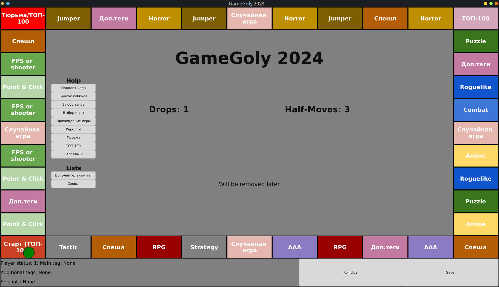

# GameGoly

GameGoly - это настольная игра, сделанная с целью изучить и попробовать новые игры различных жанров и стилей, вышедших в steam. Концепция проекта вдохновлена стримерским ивентом [ХПГолия](https://docs.google.com/spreadsheets/d/e/2PACX-1vQE3NOLPo4WjgT2gu_F-ezS9n2teaFMAcEFTV3GBSaUiqPl--g1g54UPrnqUopyi1xljhQYjuCVPQkQ/pubhtml#) ([Альтернатива](https://rodich.ru/hpgoly)).


## Отличия от ХПГолии

1) **Соло геймплей**. Проект расчитан на одного игрока.
2) **Кастомизация**. Большинство вещей меняются в конфиге поля и могут быть скорректированны пользователем.
3) **Хорошие игры**. В отличии от ХПГ ивентов, расчитаных на прохождение любых, даже самых плохих, игр, GameGoly старается дать вам возможность попробовать поиграть в хорошие, но случайные игры, используя базовое ограничения в 400 подписчиков в steam хабе, выбор альтернативной игры, клетки по типу ТОП-100 и другие способы.
4) **Отсутсвие временных рамок**. В ХПГ ивентах часто встречаются сектора, требованием к которым является время HLTB, подобные условия не только сужает круг потенциальных проектов, но и заставляет игроков избегать клетки с характерным жанром, например, JRPG. В GameGoly реализиуются только два требования к игре: **теги и рейтинг**.

## Технические особенности
GameGoly легко сломать, особенно ее первые версии, поэтому не рекомундется менять конфиг, не разобравшись с ним заранее, пытаться вводить сомнительные значения и нажимать кнопки, которые не стоит жать в текущий момент. Большинство ошибок связанных не с конфигом обработаются приложением, но, вероятно, не все.<br>
GameGoly требует ручного сохранения, это сделано в основном для удобства во время разработки приложения, но также это позволяет вам "отменить" текущий ход.<br>
Если возникает ситуация, которой быть не должно, то следует изменить конфиг игрока (player.json).

## Установка
1) (если отсутствует) Установите rust (win: ```winget install -e —id Rustlang.Rustup```)
2) Склонируйте репозиторий ```git clone https://github.com/laniavea/gamegoly.git```
3) Смените активную директорию ```cd gamegoly```
4) Соберите проект ```cargo build --release``` (Если rust был только что установлен возможно потребуется перезапуск терминала).
5) Скопируйте исполняемый файл в любое место из ```gamegoly/target/release/gamegoly[.exe]```
6) Скопируйте файлы player.json и field.json в директорию с исполяемым файлом.
7) (опционально) Удалите директорию target из папки с репозиторием.
